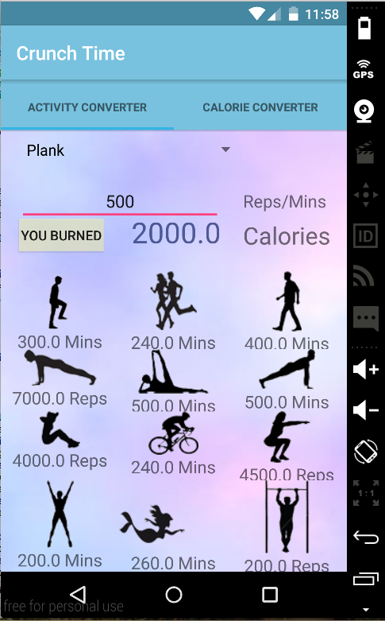
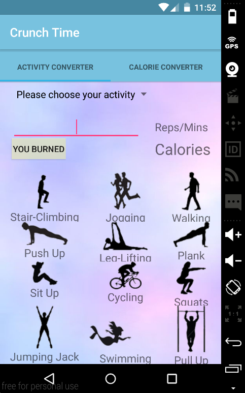
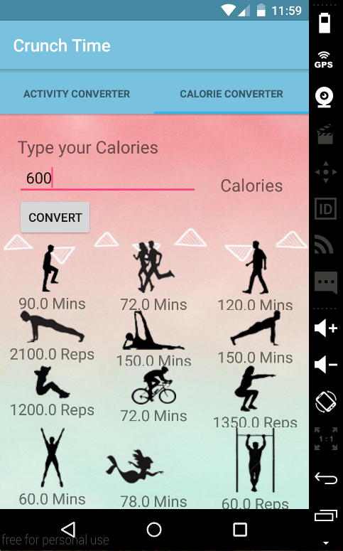
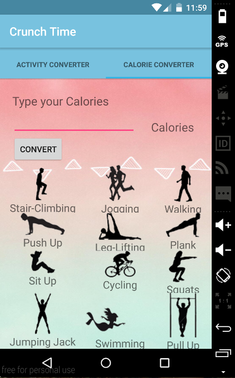

# PROG 01: Crunch Time

This application has a very simple interface and it is also easy to use. When opened, there are two tabs, which serve different purpose. If the user wants to check the amount of calories burnt through a certain activity, he/she will want to choose the Activity Converter. Otherwise, the Calorie Converter is used for converting a desired calorie amount to the reps and time of different activities. This app offers 12 activities in total and it varies in different fields so it is very convenient for the users.

In Activity Converter tab, it first prompts to user to choose the activity the want to convert and type in the amount of exercise. It then calculates and shows the calories amount on the screen along with the equivalent amount of exercise of other 11 activities. 

Converter tab, it is quite similar with the first tab except that it prompts to user the amount of calorie he/she wishes to convert. It then calculates and shows on the table.   

## Authors

FirstName LastName ([phoebevu91@berkeley.edu](mailto:phoebevu91@berkeley.edu))

## Demo Video

See [Sp16 Crunch Time App Demo] (https://www.youtube.com/watch?v=YVIcQ39w-kk&feature=youtu.be)

## Screenshots

## Acknowledgments

* Hat tip to anyone who's code was used
* Any other support
Sliding Tabs Layout - Google Ioschedule GitHub

https://github.com/google/iosched/blob/master/android/src/main/java/com/google/samples/apps/iosched/ui/widget/SlidingTabLayout.java
https://github.com/google/iosched/blob/master/android/src/main/java/com/google/samples/apps/iosched/ui/widget/SlidingTabStrip.java

StackOverFlow for material design (layout, table..etc)

*Feel free to enhance your README. For Markdown syntax, see [the GitHub Guides](https://guides.github.com/features/mastering-markdown/). Remove this line in your submission.*
